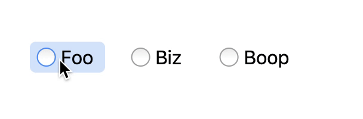

# `@palmerhq/radio-group`

An accessible [WAI-ARIA 1.1-compliant Radio Group](https://www.w3.org/TR/wai-aria-practices-1.1/#radiobutton) React component.



<!-- START doctoc generated TOC please keep comment here to allow auto update -->
<!-- DON'T EDIT THIS SECTION, INSTEAD RE-RUN doctoc TO UPDATE -->

**Table of Contents**

- [Installation](#installation)
- [Usage](#usage)
  - [Usage with Formik v2](#usage-with-formik-v2)
- [Overriding Styles](#overriding-styles)
- [Accessibility Features](#accessibility-features)
- [Keyboard Support](#keyboard-support)
- [Role, Property, State, and Tabindex Attributes](#role-property-state-and-tabindex--attributes)
- [Authors](#authors)

<!-- END doctoc generated TOC please keep comment here to allow auto update -->

## Installation

```
yarn add @palmerhq/radio-group
```

## Usage

```tsx
import * as React from 'react';
import { RadioGroup, Radio } from '@palmerhq/radio-button';
import '@palmerhq/radio-button/styles.css'; // use the default styles

function App() {
  const [value, setValue] = React.useState<string | undefined>();

  return (
    <>
      <h3 id="color">Color</h3>
      <RadioGroup labelledBy="color" onChange={value => setValue(value)}>
        <Radio value="blue">Blue</Radio>
        <Radio value="red">Red</Radio>
        <Radio value="green">Green</Radio>
      </RadioGroup>
    </>
  );
}
```

### Usage with Formik v2

```tsx
import * as React from 'react';
import { Formik, Form, useField } from 'formik';
import { RadioGroup, Radio } from '@palmerhq/radio-button';
import '@palmerhq/radio-button/styles.css'; // use the default styles

function FRadioGroup(props) {
  const [{ onChange, onBlur, ...field }] = useField(props.name);
  return (
    <RadioGroup
      {...props}
      {...field}
      labelledBy={props.name}
      onBlur={onBlur(props.name)}
      onChange={onChange(props.name)}
    />
  );
}

function App() {
  return (
    <Formik
      initialValues={{ color: '' }}
      validationSchema={Yup.object().shape({
        color: Yup.string().required(),
      })}
      onSubmit={(values, { setSubmitting }) => {
        setTimeout(() => {
          alert(JSON.stringify(values, null, 2));
          setSubmitting(false);
        }, 500);
      }}
    >
      <Form>
        <h3 id="color">Color</h3>
        <FRadioGroup name="color">
          <Radio value="blue">Blue</Radio>
          <Radio value="red">Red</Radio>
          <Radio value="green">Green</Radio>
        </FRadioGroup>
      </Form>
    </Formik>
  );
}
```

## Overriding Styles

These are the default styles. Copy and paste the following into your app to customize them.

```css
[data-palmerhq-radio-group] {
  padding: 0;
  margin: 0;
  list-style: none;
}

[data-palmerhq-radio-group]:focus {
  outline: none;
}

[data-palmerhq-radio] {
  border: 2px solid transparent;
  border-radius: 5px;
  display: inline-block;
  position: relative;
  padding: 0.125em;
  padding-left: 1.5em;
  padding-right: 0.5em;
  cursor: default;
  outline: none;
}

[data-palmerhq-radio] + [data-palmerhq-radio] {
  margin-left: 1em;
}

[data-palmerhq-radio]::before,
[data-palmerhq-radio]::after {
  position: absolute;
  top: 50%;
  left: 7px;
  transform: translate(-20%, -50%);
  content: '';
}

[data-palmerhq-radio]::before {
  width: 14px;
  height: 14px;
  border: 1px solid hsl(0, 0%, 66%);
  border-radius: 100%;
  background-image: linear-gradient(to bottom, hsl(300, 3%, 93%), #fff 60%);
}

[data-palmerhq-radio]:active::before {
  background-image: linear-gradient(
    to bottom,
    hsl(300, 3%, 73%),
    hsl(300, 3%, 93%)
  );
}

[data-palmerhq-radio][aria-checked='true']::before {
  border-color: hsl(216, 80%, 50%);
  background: hsl(217, 95%, 68%);
  background-image: linear-gradient(
    to bottom,
    hsl(217, 95%, 68%),
    hsl(216, 80%, 57%)
  );
}

[data-palmerhq-radio][aria-checked='true']::after {
  display: block;
  border: 0.1875em solid #fff;
  border-radius: 100%;
  transform: translate(25%, -50%);
}

[data-palmerhq-radio][aria-checked='mixed']:active::before,
[data-palmerhq-radio][aria-checked='true']:active::before {
  background-image: linear-gradient(
    to bottom,
    hsl(216, 80%, 57%),
    hsl(217, 95%, 68%) 60%
  );
}

[data-palmerhq-radio]:hover::before {
  border-color: hsl(216, 94%, 65%);
}

[data-palmerhq-radio][data-palmerhq-radio-focus='true'] {
  border-color: hsl(216, 94%, 73%);
  background-color: hsl(216, 80%, 97%);
}

[data-palmerhq-radio]:hover {
  background-color: hsl(216, 80%, 92%);
}
```

## Accessibility Features

- Uses CSS attribute selectors for synchronizing `aria-checked` state with the visual state indicator.
- Uses CSS `:hover` and `:focus` pseudo-selectors for styling visual keyboard focus and hover.
- Focus indicator encompasses both radio button and label, making it easier to perceive which option is being chosen.
- Hover changes background of both radio button and label, making it easier to perceive that clicking either the label or button will activate the radio button.

<h2 id="kbd_label">Keyboard Support</h2>

<table aria-labelledby="kbd_label" class="def">
  <thead>
    <tr>
      <th>Key</th>
      <th>Function</th>
    </tr>
  </thead>
  <tbody>
    <tr data-test-id="key-tab">
      <th><kbd>Tab</kbd></th>
      <td>
        <ul>
          <li>Moves focus to the checked <code>radio</code> button in the <code>radiogroup</code>.</li>
          <li>If a <code>radio</code> button is not checked, focus moves to the first <code>radio</code> button in the group.</li>
        </ul>
      </td>
    </tr>
    <tr data-test-id="key-space">
      <th><kbd>Space</kbd></th>
      <td>
        <ul>
          <li>If the <code>radio</code> button with focus is not checked, changes the state to <code>checked</code>.</li>
          <li>Otherwise, does nothing.</li>
          <li>Note: The state where a radio is not checked only occurs on page load.</li>
        </ul>
      </td>
    </tr>
    <tr data-test-id="key-right-arrow">
      <th><kbd>Right arrow</kbd></th>
      <td>
        <ul>
          <li>Moves focus to and checks the next <code>radio</code> button in the group.</li>
          <li>If focus is on the last <code>radio</code> button, moves focus to the first <code>radio</code> button.</li>
          <li>The state of the previously checked radio button is changed to unchecked.</li>
        </ul>
      </td>
    </tr>
    <tr data-test-id="key-down-arrow">
      <th><kbd>Down arrow</kbd></th>
      <td>
        <ul>
          <li>Moves focus to and checks the next <code>radio</code> button in the group.</li>
          <li>If focus is on the last <code>radio</code> button, moves focus to the first <code>radio</code> button.</li>
          <li>The state of the previously checked radio button is changed to unchecked.</li>
        </ul>
      </td>
    </tr>
    <tr data-test-id="key-left-arrow">
      <th><kbd>Left arrow</kbd></th>
      <td>
        <ul>
          <li>Moves focus to and checks the previous <code>radio</code> button in the group.</li>
          <li>If focus is on the first <code>radio</code> button, moves focus to and checks the last <code>radio</code> button.</li>
          <li>The state of the previously checked radio button is changed to unchecked.</li>
        </ul>
      </td>
    </tr>
    <tr data-test-id="key-up-arrow">
      <th><kbd>Up arrow</kbd></th>
      <td>
        <ul>
          <li>Moves focus to and checks the previous <code>radio</code> button in the group.</li>
          <li>If focus is on the first <code>radio</code> button, moves focus to and checks the last <code>radio</code> button.</li>
          <li>The state of the previously checked radio button is changed to unchecked.</li>
        </ul>
      </td>
    </tr>
  </tbody>
</table>

<h2 id="rps_label">Role, Property, State, and Tabindex  Attributes</h2>
<table aria-labelledby="rps_label" class="data attributes">
<thead>
  <tr>
    <th scope="col">Role</th>
    <th scope="col">Attributes</th>
    <th scope="col">Element</th>
    <th scope="col">Usage</th>
  </tr>
</thead>
<tbody>
  <tr data-test-id="radiogroup-role">
    <th scope="row"><code>radiogroup</code></th>
    <td></td>
    <td><code>div</code></td>
    <td>
      <ul>
        <li>Identifies the <code>div</code> element as a container for a group of <code>radio</code> buttons.</li>
        <li>Is not focusable because focus is managed using a roving tabindex strategy as described below.</li>
      </ul>
    </td>
  </tr>
  <tr data-test-id="radiogroup-aria-labelledby">
    <td></td>
    <th scope="row"><code>aria-labelledby="[IDREF]"</code></th>
    <td><code>div</code></td>
    <td>Refers to the element that contains the label of the radio group.</td>
  </tr>
  <tr data-test-id="radio-role">
    <th scope="row"><code>radio</code></th>
    <td></td>
    <td><code>div</code></td>
    <td>
      <ul>
        <li>Identifies the <code>div</code> element as an ARIA <code>radio</code> button.</li>
        <li>The accessible name is computed from the child text content of the <code>div</code> element.</li>
      </ul>
    </td>
  </tr>
  <tr data-test-id="radio-tabindex">
    <td></td>
    <th scope="row"><code>tabindex="-1"</code></th>
    <td><code>div</code></td>
    <td>
      <ul>
        <li>Makes the element focusable but not part of the page <kbd>Tab</kbd> sequence.</li>
        <li>Applied to all radio buttons contained in the radio group except for one that is included in the page <kbd>Tab</kbd> sequence.</li>
        <li>This approach to managing focus is described in the section on <a href="https://www.w3.org/TR/wai-aria-practices-1.1/#kbd_roving_tabindex">roving tabindex</a>.</li>
      </ul>
    </td>
  </tr>
  <tr data-test-id="radio-tabindex">
    <td></td>
    <th scope="row"><code>tabindex="0"</code></th>
    <td><code>div</code></td>
    <td>
      <ul>
        <li>Makes the radio button focusable and includes it in the page <kbd>Tab</kbd> sequence.</li>
        <li>Set on only one radio in the radio group.</li>
        <li>On page load, is set on the first radio button in the radio group.</li>
        <li>Moves with focus inside the radio group so the most recently focused radio button is included in the page <kbd>Tab</kbd> sequence.</li>
        <li>This approach to managing focus is described in the section on <a href="https://www.w3.org/TR/wai-aria-practices-1.1/#kbd_roving_tabindex">roving tabindex</a>.</li>
                </ul>
              </td>
            </tr>
            <tr data-test-id="radio-aria-checked">
              <td></td>
              <th scope="row"><code>aria-checked="false"</code></th>
              <td><code>div</code></td>
              <td>
                <ul>
                  <li>Identifies <code>radio</code> buttons which are not checked.</li>
                  <li>CSS attribute selectors (e.g. <code>[aria-checked="false"]</code>) are used to synchronize the visual states with the value of the <code>aria-checked</code> attribute.</li>
                  <li>The CSS <code>::before</code> pseudo-class is used to indicate visual state of unchecked radio buttons to support high contrast settings in operating systems and browsers.</li>
                </ul>
              </td>
            </tr>
            <tr data-test-id="radio-aria-checked">
              <td></td>
              <th scope="row"><code>aria-checked="true"</code></th>
              <td><code>div</code></td>
              <td>
                <ul>
                  <li>Identifies the <code>radio</code> button which is checked.</li>
                  <li>CSS attribute selectors (e.g. <code>[aria-checked="true"]</code>) are used to synchronize the visual states with the value of the <code>aria-checked</code> attribute.</li>
                  <li>The CSS <code>::before</code> pseudo-class is used to indicate visual state of checked radio buttons to support high contrast settings in operating systems and browsers.</li>
                </ul>
              </td>
            </tr>
          </tbody>
        </table>

## Authors

- Jared Palmer ([@jaredpalmer](https://twitter.com/jaredpalmer))

---

> MIT License
